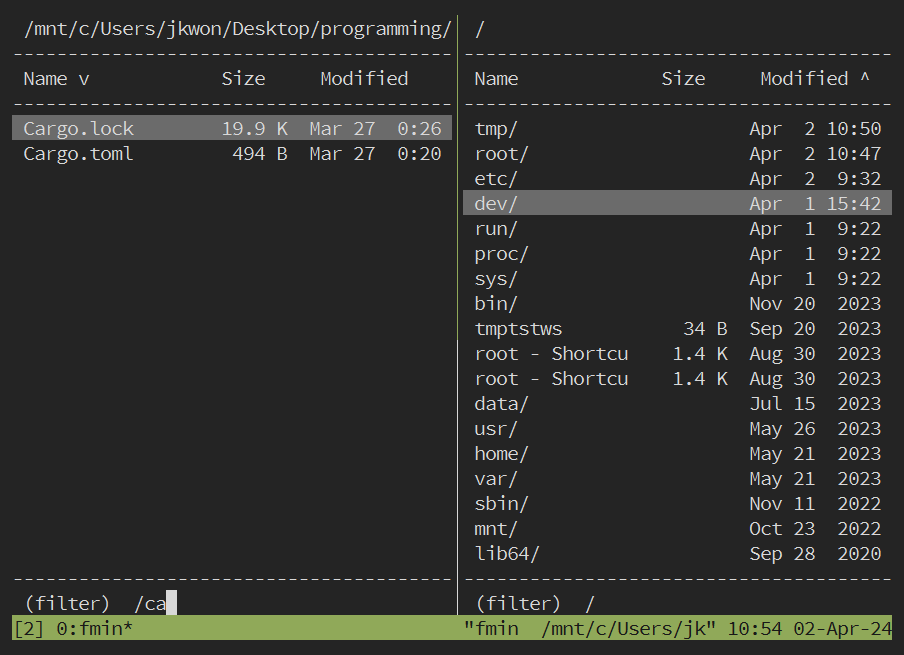

# fmin

A terminal file manager inspired by [fman](https://fman.io/).



## Features

- `Enter` to nav forward, `Backspace` to nav back

<!-- - type to filter directory contents, `Esc` to clear; capital letters reserved (see below) -->
- type to filter directory contents, `Esc` to clear

<!--
- `Shift+J/K` to nav up/down

- `Shift+P`: open command palette of operations like copy/paste, as well as imported shell scripts

- `Shift+O`: jump to frequently visited directories

- sort by `Shift+N` file **n**ame, `Shift+S` file **s**ize, or `Shift+M` date **m**odified
-->

<!-- Shift + Space to mark as selected?? -->

<!-- - `Shift+Q` or `Ctrl+C` to quit -->
- `Ctrl+C` to quit

see `main.rs::update()` for all keybindings

## Installation

(while early development) `git clone https://github.com/wong-justin/fmin.git` then build.

<!--
Note that `fmin` writes to two files:

___

- `$FMIN_HOME/fmin.history`, which tracks visited directories. Necessary to accumulate popular paths over time

- `$FMIN_HOME/fmin.highlighted_path`, which contains the path currently under `fmin`'s cursor. Useful for scripting custom commands

IF `$FMIN_HOME` is not set at runtime, `fmin` will create a directory named `.fmin/` according to the xdg_home spec, namely at 1) ..., 2)... , or 3) ...

Here's what a zero-config installation might look like after `fmin` runs:
```
└── $HOME/.fmin/
    ├── fmin.history
    └── fmin.highlighted_path
...
└── /usr/bin/fmin
```
-->

## Configuration

`fmin` works out of the box with zero configuration.
But I recommend using a startup script:

```
#!/bin/sh
cd $(path/to/fmin)
```

<!--
```
#!/bin/sh

set FMIN_HOME $HOME/.fmin/

# these one-liners will be imported as custom commands (as long as it's $FMIN_CMD_[anything])
# their stdout will be written to fmin's status line (so hopefully it's terse)
# comments will be searchable in fmin's command palette (so treat like titles)
# [change these and make your own!]

set FMIN_CMD_0 '#unzip \
  tar -xvf (cat $FMIN_HOME/fmin.highlighted_path)'
set FMIN_CMD_1 '#print image size \
  ffmpeg --tell-me-image-dimensions (cat $FMIN_HOME/fmin.highlighted_path)'
set FMIN_CMD_2 '#open in browser \
  browser --open (cat $FMIN_HOME/fmin.highlighted_path)'
set FMIN_CMD_3 '#open native file manager \
  cmd.exe /C explorer (cat $FMIN_HOME/fmin.cwd)'
set FMIN_CMD_4 '#copy cwd to clipboard \
  cmd.exe /C clip (cat $FMIN_HOME/fmin.cwd)'
set FMIN_CMD_5 '#safe remove \
  mv (cat $FMIN_HOME/fmin.selected_paths) ~/trash/'

# start the fmin binary
# when finished, cd this shell session to fmin's last directory
# [change this path]

cd $(/wherever/you/put/fmin)
```

Here's what my `fmin` installation looks like:

```
└── $FMIN_HOME/
    ├── fmin.history
    ├── fmin.highlighted_path
    ├── fmin
    └── fmin_startup.sh
```

... along with one shell alias: `alias fmin /path/to/fmin_startup.sh`
-->

## Build

`rustc --version 1.65.0` or newer

`cargo build`

## Roadmap / To-do / Brain dump

**Goal 1**: quick, convenient directory navigation.

**Goal 2**: file management commands like copy/paste, along with custom commands

<!-- more comfortable than the shell could ever be, yet plays well with shell scripts -->

Immediate feature todos:

1) implement jumptodir feature by tracking frecency in flat file db

2) `open with...` or `open` command. let user define behavior for selecting files (ie. when Enter on a file, run user script like `browser --open-html-file $FMIN_SELECTED`). would have to work per file extension types. EDIT - actually would be nice to choose each time, even ignoring file extension, at least as a choice. eg. one time open a .pdf with vim and another time open it in browser. "ctrl+p -> open with... vim()" or "ctrl+p open with minbrowser()". see also windows console commands `start file` which i think does the same as `explorer file`

--- 

<details>
<summary>other important things to do</summary>

- clear jumptodir history eventually.. after 90days? after ranking score is at minimum? give script to clear all with minimum possible ranking score of 1 for user to manually execute (probs as one of the .sh functions to import intop command palette?)

- consider using two env vars `$FMIN_CWD` and `$FMIN_SELECTED` that stay updated so user can shell out and use them when needed. maybe also `$FMIN_OPEN=myscript.sh` as a means to import that important and custom feature. note though that multiline env var values cause problmes with `env` command, so $FMIN_SELECTED cant be newline-separated. 
	- note that this is a sort of anti-pattern, hacky way to use env vars; some may find it gross; but i think the resulting feature is a big usability/convenience win, for not much cost
	- actually it might not work: the program can set current process env vars, and set global shell .env exports, but can't change parent process, and can't tell other processes that a global env var was updated, so other processes would have to source the .env file to use the recently updated paths (lame)
	- this is all getting too complex; maybe have a nice program function for copying cwd to clipboard, and user can easily cd <paste> afterwards if they want. this still doesnt solve live scripting with selected files tho - maybe those filepaths can be copied to clipboard as well.
	- probably just use files; write data to /tmp/fmin_cwd or something like that
	- maybe fmin.sh = 
	```
	set FMIN_SHIFT_Z 'tar -xvf (cat /tmp/fmin.filepaths)'

	fmin
	cd (cat /tmp/fmin.cwd)
	```
	- actually `fmin` writes cwd to stdout now! so just `cd $(fmin)`
	- investigate std::env::set_current_dir as an alternative to $FMIN_CWD
	- see also the terminal file manager that uses env vars for config: https://github.com/dylanaraps/fff?tab=readme-ov-file
which apparently uses a little-known young standard $CDPATH that i might be interested in. EDIT - i dont like cdpath and it seems pretty rare and nonstandard. it's pretty much a manually set home path per session
	- consider also: $FMIN_DELETE=rm by default, or 'mv $ /trash/'
	- also: $IFS internal field separator (https://unix.stackexchange.com/questions/184863/what-is-the-meaning-of-ifs-n-in-bash-scripting)

- performance optimization on large dirs, which is important bc slowness in large dirs was one of the main reasons for ditching fman: 

	- maybe to help large dirs go faster: only read filenames first and be ready to display, then if that took a long time (or huersitic if dir has >1000 files) only display filenames with metadata (loading), and iterate thru entries to get metadata and finish displaying with that second step
eg. displaying newly entered directory, part 1
```
___________________________________________
 Name                v | Size   | Modified
___________________________________________
loopy/                     loading...
droopy/                    loading...
grumpy/                    loading...
frumpy/                    loading...
script1.py                 loading...
script_2.py                loading...
main.py                    loading...
utils.py                   loading...
                                            
(this dir has a lot of entries)
___________________________________________
```
second step will read metadata date and size and calc display. also note im doing a math.log() call for size formatting... probably not helping. i just realized thats easily replaceable with a few `(x < 10? x < 100? x < 1000?)` cases - measure and make sure thats faster
	- bonus points if program is still responsive to keypresses, especially between 1st and 2nd steps while metadata is loading
	- MUST measure performance between both options tho - try creating perf test then git branch to test new implementation
	- also, if i already have sorted vec<entry> and i know view_start and view_end, then i only need to format strings for entries between view_start and view_end before displaying, instead of formatting each entry in whole vec. also memoization will help if i structure the code to make repeat formatting calls
	- note that fman slowness was in the order of seconds, and so far my longest load times are less than a second. so maybe this is not as huge a priority as previously thought
	- also note that perhaps the essential I/O of reading a directory is taking the majority of the time, and these other improvements might be negiligble and not worth the effort. I should make a flamegraph

- also consider caching large dir results, and having filewatcher processes knowing when to clear the cache id the dir is modified

- dual pane? or N-pane, with client/server architecture? where server just holds yanked filepaths... kinda overkill. maybe connect with unix pipes? also consider multiplatform... maybe cli option `--pair-with-session` to opt in to a dual pane? --pair-with-last, --print-all-session-ids, --start-background-server

- make sure all rust functions take borrowed struct params, unless they are supposed to take ownership after the function call
</details>

<details>
<summary>nice-to-haves, eventually</summary>

- make sure network filesystems work, like google drive or dropbox or nas'es

- icons, like nerdfont, or at least ascii chars, just to add redundancy to make visually identifying files easier (.py, directories, .md, source code, plaintext, binaries, etc)

- consider shift+m like a shift+click on windows, meaning select all from beginning mark up to cursor 

- display idx/total item count in bottom right. also num selected items

- potential cli/config options: `--start-jumping`, `--config-at`, `--history-at`, `--logs--at`
along with types like `Config::starting_mode/logs_path/`...
or consider also zero cli options, and all config happens in env vars

- have logs in the first place

- include sortorder in history file as UX/QOL improvement, so fmin remembers your preferred sort order in each dir

- some more fringe command ideas to consider for default palette (beyond move/cut, refresh, copy, delete, sort, select, select all): new file, new folder, rename. these could be outsourced to custom scripts/functions tho, esp if they're not used often

- be able to delete directories in frecency list (rather than opening flat history db file and editing / deleting lines). Note that some dirs temporarily appear and disappear, like USBs, and those should never be deleted automatically just because they arent present at a certain moment

- use docopt for cli options, and maybe just a quick and dirty custom implementation instead of the full library/dsl since that repo sounded problematic and not worth a dependency, and most complexity should live in the tui and not the cli anyways. i just like docopt

- redundant hotkeys: ctrl+j == > or something for jumptodir, ctrl+p == : for command palette, and ctrl+f == / for filter/search. bc control keys are good from any mode, whereas typical vim mode you have to escape back to normal mode before entering another. although reminder to self that many ctrl+key presses are reserved terminal shortcuts, so try not to override them

- other plugin function ideas: print width/height for img/video files, duration of audio/video files, batch rename selected? (eg. img_01, img_02, etc), copy cwd abs path to clipboard

- for batch rename, consider opening vim/$editor buffer to let user macro their own filename pattern edits. thats what this file manager does in their demo video: https://github.com/sxyazi/yazi

- keep command palette context dependent, eg. show up/down navigation in normal mode, but hide those and show others like esc keybind for filter mode

- add filewatcher to cwd so tui live updates when files are added/removed/modified

- write --help text, full docs in readme, and consider coverting to manpage too

- support --version if it's not already free with crossterm

- do some stress tests, like dir with 1k, 100k, many files (programming/texting/data/cleaned/media is a good real example with 2300 items. also c/windows/sytem32, 5000 entries. also staged / setup test dirs). and dirs with really large files (that seems fine so far tho). then weird unicode filenames. then spamming actions like typing filter text and naving back and forth. also going to weird dirs like recycle bin. see also symlinks. then networked/virtual filesystems.

- support unicode filenames and input text? eh, only once i finish other features that i care about that matter for personal use...

- support rebinding keys? not sure how control characters and letters work on other non-american keyboards... same low priority as above tho

- drag n drop with COM objects on windows? terinal detect mouse hold event -> create COM object for windows-os-level drag n drop -> do something... that would be more of a plugin functionality, and it would take a long time to learn about and hack on COM. although this is kinda important since i do lots of drag n drop in my workflow. but less important if theres a quick `open in native os file explorer` command

- if shortening long strings, consider using unicode char (…) instead of 3 dots(...) since it takes up less space

- also consider shortening abs paths like cwd into abbreviated form, eg. `/m/c/u/j/desktop` for `/mnt/c/users/jkwon/desktop`

- also consider shortening `/mnt/c/users/jkwon/Desktop` to `~/Desktop,` and all those home directories, since they get reptitive and dont bring important information for me personally. maybe try that on a feature branch, not master

- any max length to consider when shortening strings? some data points: 80ch historic terminal width. average filename length on my machine __ chars (todo - measure it). max filename length on my machine: __ chars (measure this too). `cal` output width, as an example of skinny output: 20ch for one month (62ch for 3 months). my clock script - ~50ch. and with smallclockchars, probably ~25ch. right now, date field is 14ch and size is 7ch, so name should be >= 14ch too. Or >= 21. so 21 + 7 + 14 + 4ch of margins = 46ch minimum in a sense. still need to shorten paths that are too long tho, and cwds over 40ch

- consider having shortened versions of date and size for tiny terminal sessions?
like use `display::CompactWidth/Condensed/Comfortable` if name_col is less than size + modified cols

- consider leader key + normal keypress, where user can define leader key, which works well for sxiv tool (see https://youtu.be/GYW9i_u5PY://youtu.be/GYW9i_u5PYs) 

- consider caching Format trait on Date and Size, in case it helps

</details>

<details>
<summary>other thoughts</summary>

- remember to have confirmation step before perofrming action that modifies filesyystem (eg. `move 10 files to new/dir/? [y/n]`)
or alternatively make it easy to undo
or alternatively harder to perform on accident, eg. not a simple keypress in normal mode, esp since its easy to think youre in filter mode by mistake
maybe keep those actions limited to command palette with no shortcut? move/copy/delete/rename

- i like how displaying more information lets you release some headspace - dont have to remember if file is big or small; dont have to remember ls -whatevercommands to format file info; seeing big file size in addition to name can help identify file quicker in your brain, same with modified date; always displaying cwd (which ive omitted in my $prompt for the sake of space); perhaps helps when burned out, freeing up mental space and energy

- also enjoy minimal keypresses, esp when coupled with minimal thinking - eg. ctrl+p one step shortcut to jump from any mode to command palette mode, rather than remembering page/modal navigation and esc -> colon:, two steps and extra keypress 

- reminder to self that the UI is not as complex because no need for linewrapping - keep it that way 

- look at fman issues, both open and closed, to see people's most desired features: https://github.com/fman-users/fman/issues?q=is%3Aissue+sort%3Areactions-%2B1-desc
the main ones:
	- search (presumably recursively in cwd; low priority for me personally; could be a ls | grep command anyways; and text search is an rgrep command)
	- batch rename (this is rarer and could be outsourced to `$editor` where macro editing is optimized)
	- commmand to compute directory size (this should be plugin script/function, not core)
	- feedback on file operations
	- remember sort order for dirs
	- undo for commands rename/copy/delete (probably difficult, and less important if these dont happen by accident. also if delete is aliased to `mv $trash`)

- midnight commander has lots of arcane keybindings, including function keys all the way at the top of the keyboard, and a bit of chording; ideally the command palette is the opposite experience, that is, immediately understandable and productive, with minimal learning curve

- i found this other windows text-view file manager: https://www.farmanager.com/screenshots.php?l=en

</details>

## feedback welcome; also some questions im wondering about

- what are all the options for reading user-defined shell functions during runtime? see also: https://clig.dev/#configuration

im leaning towards an env var `$FMIN_OPEN=script.sh`, but that would need a new script for each function i think. not a good idea to parse multiple functions out of a single script - id rather just execute the script and be done with it. 
some tools use .config files, so possibly fmin.config = `open: /path/to/open.sh \nopen in browser: /path/to/browseropen.sh`.

the suckless philosophy would say fork, edit source, and recompile, but that depends on the userhaving a rust dev envirinoment, or me having github actions working properly so its easy to fork and rebuild

bonus points for solutions that dont require extra files in particular locations in particular formats, but instead only a zero-file configuration, or one flexible file

maybe command-line options on start? `fmin --cmd-open=/path/to/open.sh --cmd-open-with-browser=/path/to/openwithbrowser.sh`

that would get ugly quick tho. and poor design because cli options are designed for config that changes often "from one invocation of the command to the next", whereas these shell functions should be reused every launch.

- crossterm lib uses `u16` for functions like MoveTo(), etc. but some other functions use `usize`. is `usize::from()`ing the u16s as early as possible and `usize.try_into().unwrap()`ing the best way to go? smells unclean. and is it wrong to prefer the `usize` as the truer type represnetation of an "unlimited" unsigned int, compared to `u16` which feels like an arbitray limit? and has anyone ever needed a terminal sized more than 65536 chars wide/rows tall?

- how do non-american keyboards use vim hotkeys and other ascii char usecases, eg. WASD for games? will those keyboards still be able to input a-z,ctrl+[a-z],shift+[a-z] easily? do power users usually have a qwerty remap layer for these kinds of programs?

- any cleanish, faster alternatives to the model-update-view application loop that avoids writing so many bytes to stdout each update frame? the current way feels a tad slow. or maybe windows terminal is just getting too slow for me personally, and it's not so much the application's fault

- is it possible / worth incorporating tools for fuzzy matching and frecency tracking, like [fzf](https://github.com/junegunn/fzf) and [z](https://github.com/rupa/z)? in my opinion, it seems like a pain to integrate those shell tools, between code interface and user setup/installation, compared to reimplementing the basic functionality in rust (eg. string substring match instead of fuzzy match)

- what sorts of file manager edge cases am I not anticipating beyond simple reading directories and files? so far i can think of symlinks, networked filesystems, read/write permissions, very large directories, very long file operations like copying hundreds of GBs, removable drives like USBs, ... I guess these things reveal themselves with users

- how does this behave on mac? any weird directories or OS conventions or runtime errors?

- what are popular/effective file size formats? like how many decimal places, digits, unit abbreviations. it seems like each file manager chooses a different display format. see `main.rs:: impl Display for FileSize` for formats I've found so far
